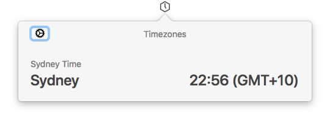
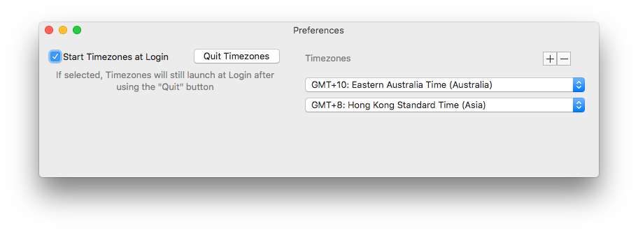

# Timezones 🕔

This is macOS App for keep tracking of multiple Time Zones. Nothing fancy.

Requires macOS 10.13 or later.

You can download it from the latest release [here](https://github.com/franciscoamado/timezones/releases)

  
  

## Features

- [x] Set and Show configurable TimeZones

// TODO:

- [ ] Detect users Location/TimeZone
- [ ] Interactive World Map View of TimeZones
- [ ] Change System TimeZone
- [ ] Sunrise/sunset
- [ ] Changing StatusBar icon with current time
- [ ] Weather information
- [ ] Night mode 😎

## Acknowledgements

This App uses some dependencies to make life more interesting:

* [LaunchAtLogin](https://github.com/sindresorhus/LaunchAtLogin) for easy adding "Launch at Login" funcionality.
* [ReSwift](https://github.com/ReSwift/ReSwift) for testing out Unidirectional Data Flow.

## Contributing

Open an issue with an idea or a PR with a fix. All help is appreciated.

